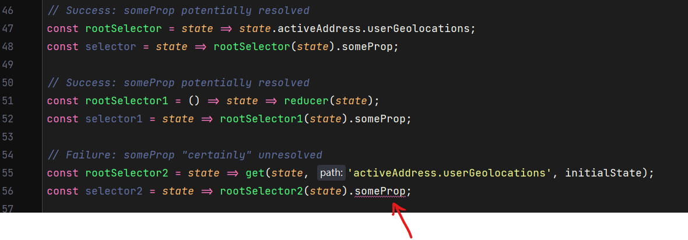

# Reproduction repo

Reproduces a bug in WebStorm 2021.3 stable on 2021-12-17, 

It was likely introduced with the fix for another bug related to properties
([reproduction repo](https://github.com/webbertakken/reproduce-fluent-method-bug),
[ticket](https://youtrack.jetbrains.com/issue/WEB-51859))
that landed in WebStorm 2021.3.

Issue is tracked here: https://youtrack.jetbrains.com/issue/WEB-54092
